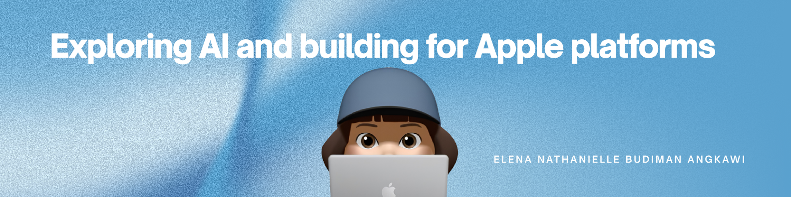

  

<!-- <h1 align="center">Elena Angkawi</h1>

  <b>Data Science undergraduate @ BINUS University</b> 
  Building at the intersection of data, AI, and software.

  
  
  
  

 -->

---

## 👋 About

I'm a 7th-semester Data Science student focused on **AI, large language models, and machine learning**, with a strong pull toward **software engineering**.
I like turning AI and ML ideas into real, usable apps, especially on **Swift / iOS**.

---

## 🔭 Currently Interested In

<table align="center">
  <tr>
    <td align="center">🤖 <b>AI</b></td>
    <td align="center">💬 <b>LLMs</b></td>
    <td align="center">📊 <b>Machine Learning</b></td>
    <td align="center">🛠️ <b>Software Engineering</b></td>
    <td align="center">📱 <b>Swift / iOS</b></td>
  </tr>
</table>

---

## 🧰 Tech Stack

<table align="center">
  <tr>
    <td align="center" width="100"> <b>Python</b></td>
    <td align="center" width="100"> <b>Swift</b></td>
    <td align="center" width="100"> <b>C</b></td>
    <td align="center" width="100"> <b>HTML</b></td>
    <td align="center" width="100"> <b>CSS</b></td>
    <td align="center" width="100"> <b>TensorFlow</b></td>
    <td align="center" width="100"> <b>PyTorch</b></td>
  </tr>
</table>

---

## 📈 GitHub Stats

  
  

  

---

## 🔗 Connect

  
  
  

